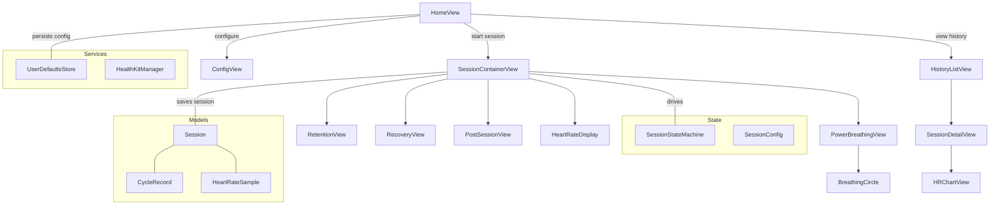
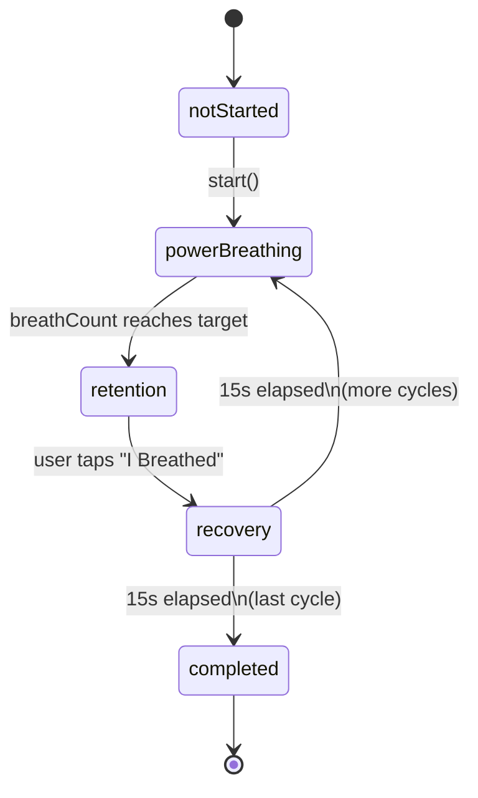
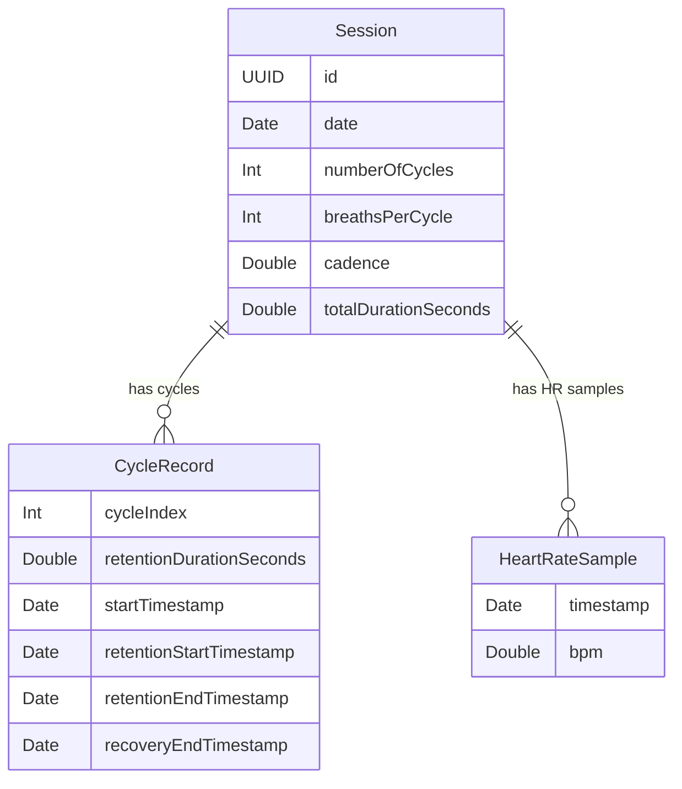
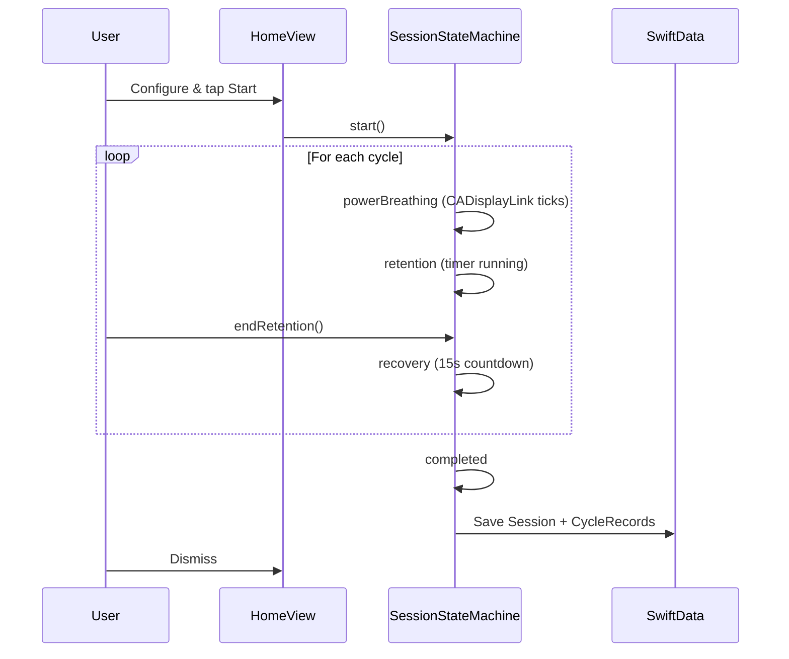

# WHAT — Wim Hof Auto Tracker

An iOS app that guides practitioners through Wim Hof Method (WHM) breathing sessions with real-time heart rate tracking.

## Architecture

The app follows a simple **Model–View–State** architecture:

- **Models** (SwiftData) — Persistent records for sessions, cycles, and heart rate samples
- **State** — An `@Observable` state machine drives the session, with a `Codable` config struct
- **Views** (SwiftUI) — Reactive UI bound to the state machine and SwiftData queries
- **Services** — HealthKit integration and UserDefaults persistence



## Session State Machine

The session is driven by a single `@Observable` class (`SessionStateMachine`) with a `Phase` enum. A single `CADisplayLink` timer drives all phases — no per-phase timer lifecycle to manage.



### Phase Details

| Phase | Driver | Transition |
|-------|--------|------------|
| **Power Breathing** | Math-based breath progress from elapsed time (avoids animation drift) | Auto-transitions when breath count reaches `breathsPerCycle` |
| **Retention** | Elapsed timer | User taps "I Breathed" — retention duration logged |
| **Recovery** | 15-second countdown | Auto-transitions to next cycle or `completed` |

## Data Model



Relationships use `@Relationship(deleteRule: .cascade)` — deleting a `Session` removes all child records.

`SessionConfig` is a separate `Codable` struct stored in `UserDefaults` (not SwiftData) to remember the user's last choices.

## Session Flow



## Project Structure

```
WHAT/
├── WHAT/
│   ├── WHATApp.swift              # App entry point, ModelContainer setup
│   ├── Models/
│   │   ├── Session.swift          # SwiftData — root session record
│   │   ├── CycleRecord.swift      # SwiftData — per-cycle timestamps + retention
│   │   └── HeartRateSample.swift  # SwiftData — timestamped HR reading
│   ├── State/
│   │   ├── SessionConfig.swift    # Codable value type for config
│   │   └── SessionStateMachine.swift  # @Observable — drives all phases + timers
│   ├── Services/
│   │   ├── HealthKitManager.swift # HealthKit auth + HR streaming (Phase 4)
│   │   └── UserDefaultsStore.swift
│   ├── Views/
│   │   ├── HomeView.swift
│   │   ├── ConfigView.swift
│   │   ├── Session/
│   │   │   ├── SessionContainerView.swift
│   │   │   ├── PowerBreathingView.swift
│   │   │   ├── BreathingCircle.swift
│   │   │   ├── RetentionView.swift
│   │   │   └── RecoveryView.swift
│   │   ├── PostSession/
│   │   │   └── PostSessionView.swift
│   │   ├── History/
│   │   │   ├── HistoryListView.swift
│   │   │   └── SessionDetailView.swift
│   │   └── Components/
│   │       └── HeartRateDisplay.swift
│   └── Charts/
│       └── HRChartView.swift      # Swift Charts (Phase 5)
├── WHATTests/                     # Unit + integration tests
├── WHATUITests/                   # UI tests
├── project.yml                    # XcodeGen project definition
└── .swiftlint.yml                 # SwiftLint configuration
```

## Testing Strategy

- **Unit tests (XCTest)**: State machine transitions, breathing math, config validation, UserDefaults persistence
- **Integration tests**: In-memory `ModelContainer` for SwiftData persistence
- **UI tests (XCUITest)**: Key user flows — configure session, start session, view history
- **Snapshot tests**: SwiftUI view regression testing via swift-snapshot-testing

## Building

```bash
# Generate Xcode project
xcodegen generate

# Build
xcodebuild -project WHAT.xcodeproj -scheme WHAT \
  -destination 'platform=iOS Simulator,name=iPhone 17,OS=latest' build

# Run tests
xcodebuild -project WHAT.xcodeproj -scheme WHATTests \
  -destination 'platform=iOS Simulator,name=iPhone 17,OS=latest' test
```
